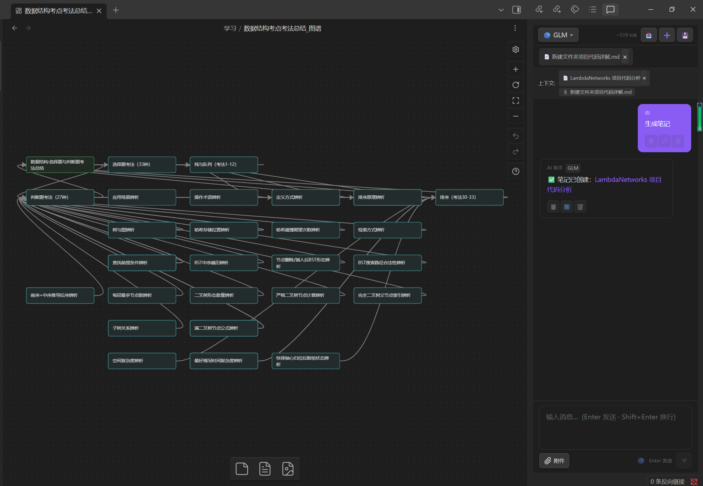
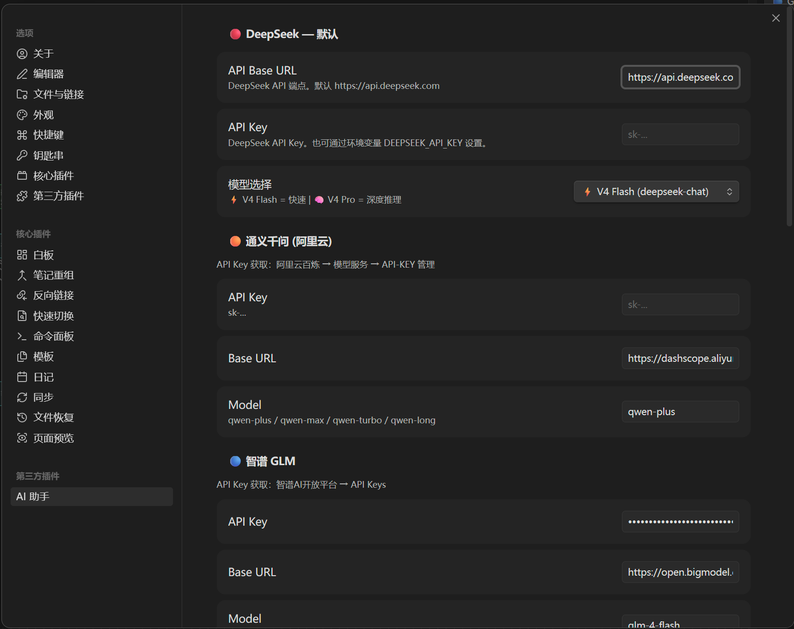
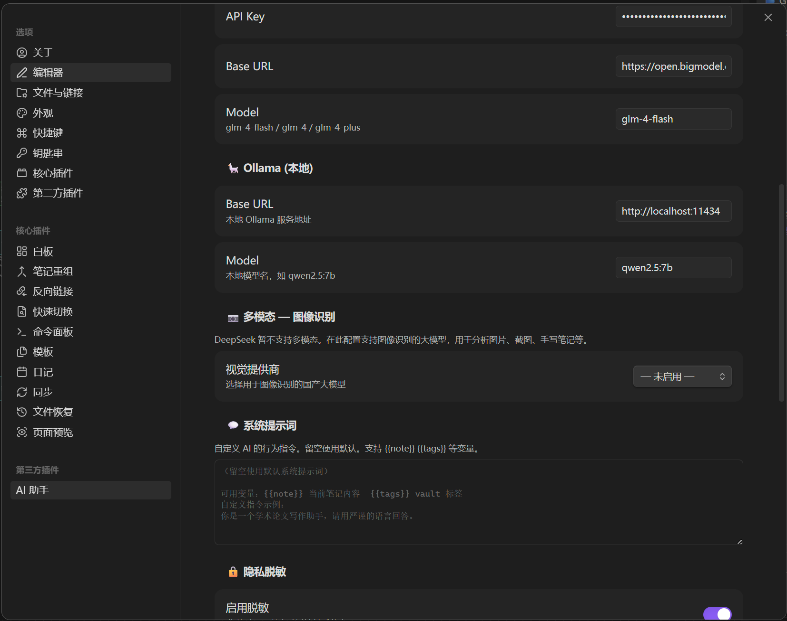
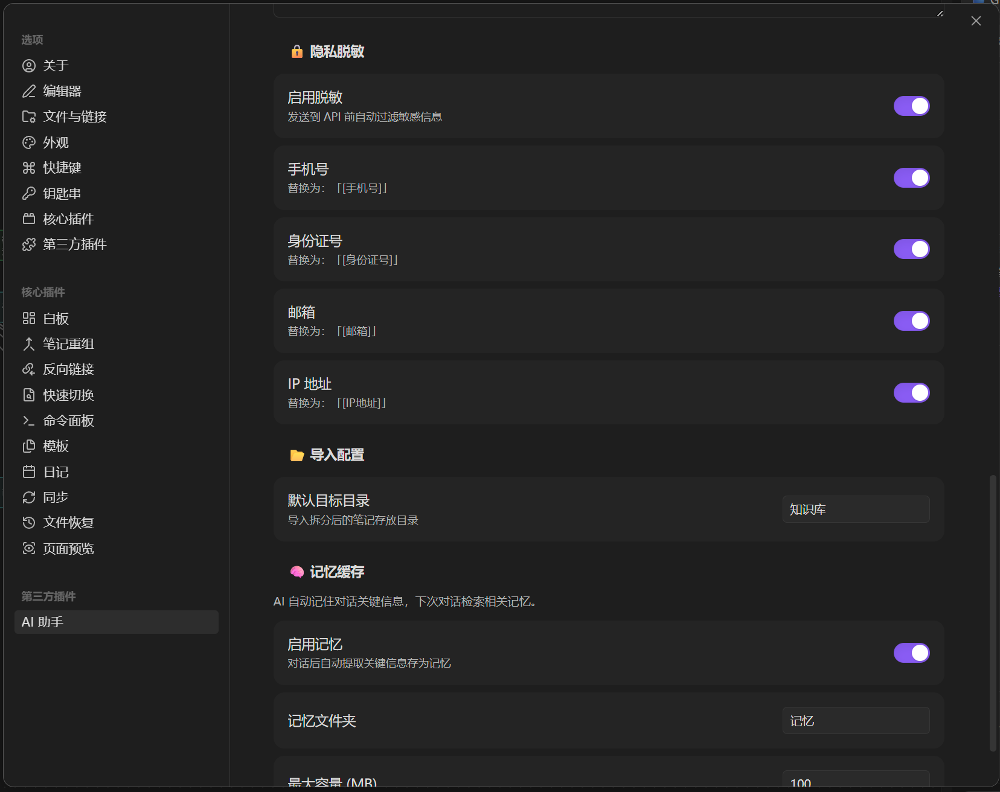

# AI 助手 �?Obsidian 插件

<p align="center">
  
  
  
  
</p>

国产大模�?AI 助手，支�?**DeepSeek / 通义千问 / 智谱 GLM / Ollama**。具�?Agentic 工具调用、多模态文件识别、ONNX 本地嵌入、Vault 语义检索、知识图谱生成等能力�?
<p align="center">
  <a href="https://qi-hub-dot.github.io/obsidian-multi-llm-ai-agent/">🌐 Demo 站点</a> ·
  <a href="https://github.com/Qi-hub-dot/obsidian-multi-llm-ai-agent/releases">📦 下载 Release</a>
</p>

---

## 📸 截图

| 知识图谱 + AI 对话 | 模型配置 |
|:---:|:---:|
|  |  |

| 本地模型 + 多模�?| 隐私脱敏 |
|:---:|:---:|
|  |  |

---

## 🚀 快速开�?
1. �?Obsidian 设置中配置任一大模�?API Key（DeepSeek / 通义千问 / 智谱 GLM�?2. 打开 AI 助手侧边�?�?开始对�?3. 试试说�?*做笔�?*」�?*画脑�?*」�?*搜索相关知识**�?
---

## �?功能

### 🤖 多模型支�?| 模型 | 特点 |
|------|------|
| 🔴 DeepSeek V4 Flash / Pro | 默认，快�?+ 深度推理 |
| 🟠 通义千问 (Qwen) | 阿里云，OpenAI 兼容 |
| 🔵 智谱 GLM-4 | 清华，OpenAI 兼容 |
| 🦙 Ollama 本地 | 支持 qwen2.5 等本地模�?|

### 🛠�?9 个内�?AI 工具
AI �?*自主调用工具**完成知识管理操作�?
| 工具 | 功能 | 触发场景 |
|------|------|----------|
| `searchVault` | 全文搜索笔记 | "有没有关于X的笔�? |
| `readNote` | 读取笔记全文 | "打开X看看" |
| `createNote` | 创建新笔记（自动分类�?| "做笔�?/ 创建一篇笔�? |
| `modifyNote` | 覆盖笔记内容 | "修改 / 重写X笔记" |
| `appendNote` | 追加到笔记末�?| "补充 / 追加到X" |
| `listNotes` | 列出所有笔�?| "有哪些笔�? |
| `getFileTree` | 浏览目录结构 | "看看文件�? |
| `getTags` | 查看标签体系 | "有哪些标�? |
| `saveCanvas` | 生成知识图谱 | "画脑�?/ 思维导图" |

> Agentic Loop：用户提�?�?AI 自主判断 �?调用工具 �?基于结果回答。最�?20 轮推理�?
### 📷 多模态文件识�?统一「附件」按钮，自动路由�?
| 文件类型 | 处理方式 |
|----------|---------|
| 图片 (png/jpg/gif/webp) | 视觉模型 OCR �?注入上下�?|
| PDF (含扫描件) | 渲染 �?视觉模型提取文字 |
| Word (docx) | mammoth 解析 |
| Markdown/TXT | 直接注入上下�?|

### 🔍 语义检�?(RAG)
- **TF-IDF 全文索引** + **ONNX 本地嵌入**�?84 维向量）三级回退：API �?ONNX �?TF-IDF
- 每次对话自动注入 Top-5 相关笔记
- 🟢高相�?/ 🟡低相关标注，AI 自行取舍

### 💬 对话体验
- 流式输出 + 思考面板（V4 Pro 推理过程可折叠）
- 消息操作：复�?/ 重新生成 / 编辑 / 删除（悬停显示）
- 模型一键切换，Token 估算

### 📝 智能笔记
- 「做笔记」→ 自动搜索 Vault �?关联 `[[已有笔记]]` �?创建文件
- 自动分类目录（`编程/Python.md`、`学习/线性代�?md`�?- Frontmatter（tags/date�? 双向链接 + Zettelkasten 原子�?
### 🧠 知识图谱
- 生成 Canvas 格式脑图，自动节点布局 + 颜色编码
- 进度卡片实时显示生成状�?
### �?快捷操作
- 编辑器选中文本 �?内联润色 / 解释 / 翻译
- 6 组快捷提示，一键发�?- 自定�?System Prompt
- 导出对话�?Markdown

### 🔒 隐私
- 本地 PII 脱敏（手机号 / 身份证号 / 邮箱 / IP�?- 记忆缓存 LRU 自动清理
- ONNX 本地嵌入完全离线运行

---

## 📦 安装

```bash
# 方式一：下�?Release
# 1. 下载 main.js / styles.css / manifest.json
# 2. 放入 .obsidian/plugins/multi-llm-ai-agent/
# 3. 重启 Obsidian �?设置 �?启用「AI 助手�?
# 方式二：从源码构�?git clone https://github.com/Qi-hub-dot/obsidian-multi-llm-ai-agent.git
cd obsidian-ai-assistant
npm install && npm run build
# �?main.js / styles.css / manifest.json 复制到插件目�?```

## ⚙️ 配置

| 配置�?| 说明 |
|--------|------|
| 🔴 DeepSeek | API Key + V4 Flash/Pro + 推理强度 |
| 🟠 通义千问 | API Key + Base URL + qwen-plus/max |
| 🔵 智谱 GLM | API Key + Base URL + glm-4-flash/plus |
| 🦙 Ollama | 本地 Base URL + 模型�?(qwen2.5:7b �? |
| 📷 多模�?| 视觉模型 (通义千问 VL / GLM-4V)，独立配�?|
| 💬 System Prompt | 自定�?AI 行为指令 |
| 🔒 脱敏 | 独立开关：手机�?/ 身份证号 / 邮箱 / IP |
| 🧠 记忆 | 记忆文件�?+ 最大容量限�?|

---

## 🛠 开�?
```bash
git clone https://github.com/Qi-hub-dot/obsidian-multi-llm-ai-agent.git
cd obsidian-ai-assistant
npm install
npm run dev     # 监听模式
npm run build   # 生产构建
npx jest        # 131 个单元测�?```

| 技术栈 |
|--------|
| TypeScript 5.3+ · React 18 · esbuild · Jest 30 |
| Obsidian API 1.5+ · Canvas JSON · TF-IDF |
| ONNX 本地嵌入 · OpenAI 兼容协议 |

## 📄 许可�?
MIT

---

## 🙏 致谢

本项目在架构设计上参考了 [Obsidian Copilot](https://github.com/logancyang/obsidian-copilot)（@logancyang，AGPL-3.0），感谢其开源贡献。本插件为独立实现，所有代码均为原创编写�?
