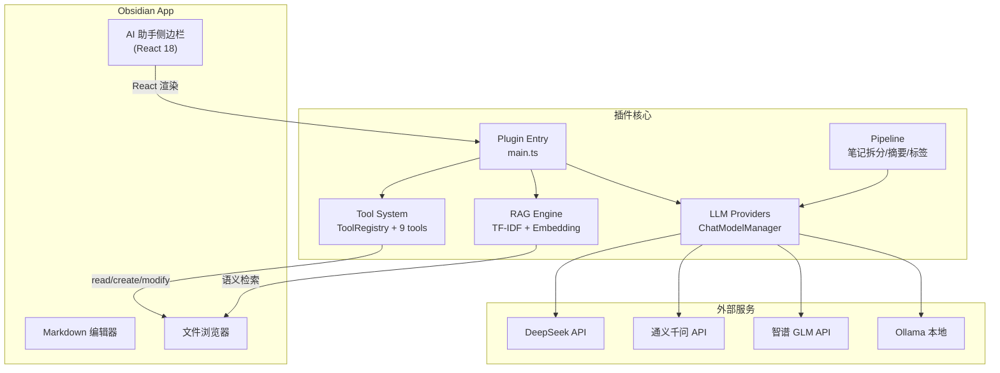
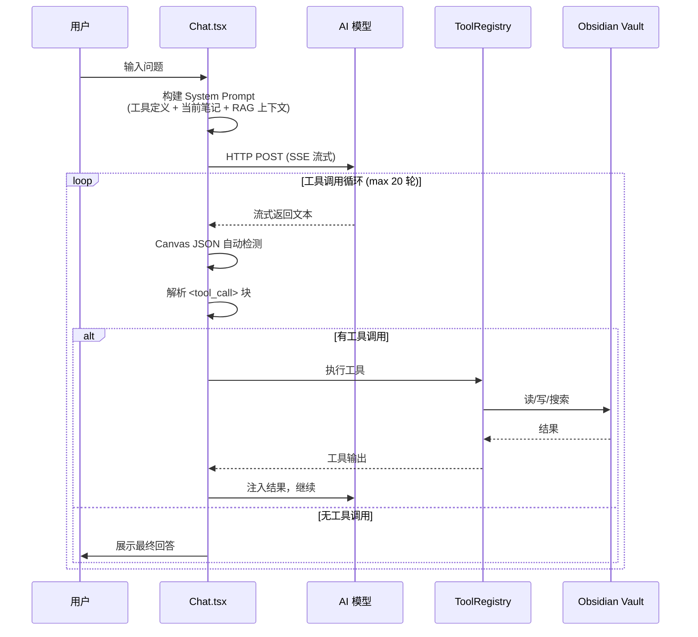
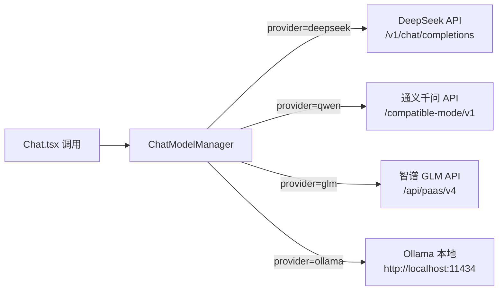
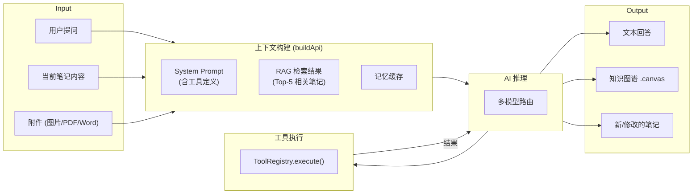

# Architecture Document — Multi-LLM AI Assistant (Obsidian Plugin v2.0)

> **Designed & Architected by Yiqi Cai** — A graduate portfolio project demonstrating system design, independent problem-solving, and research methodology in AI-augmented knowledge management.

---

## 一、系统概览

本插件是 Obsidian（基于 Electron 的本地知识库）的**侧边栏 AI 助手**。用户可在编辑笔记的同时与 AI 对话，AI 能直接操作 Vault（搜索、创建、修改笔记）并生成知识图谱。



---

## 二、模块结构

```
obsidian-ai-assistant/
├── main.ts              # 插件入口，生命周期管理
├── src/
│   ├── api.ts           # OpenAI 兼容 HTTP 客户端 (SSE 流式)
│   ├── types.ts         # 类型定义 (ChatMessage, DeepSeekError...)
│   ├── constants.ts     # 视图类型、命令 ID
│   ├── settings.ts      # 设置面板 + 配置模型
│   ├── sidebar.ts       # Obsidian ItemView (React 挂载点)
│   ├── commands.ts      # 命令注册 (快捷操作)
│   ├── pipeline.ts      # 笔记处理流水线
│   ├── memory.ts        # LRU 记忆缓存
│   ├── sanitizer.ts     # PII 脱敏引擎
│   ├── web-search.ts    # 联网搜索
│   │
│   ├── LLMProviders/
│   │   └── chatModelManager.ts  # 多模型路由器
│   │
│   ├── tools/
│   │   ├── ToolRegistry.ts      # 工具注册表 (单例)
│   │   ├── toolCallParser.ts    # <tool_call> 解析 + 提示生成
│   │   └── builtinTools.ts      # 9 个内置工具 + normalizeCanvasJSON
│   │
│   ├── ui/
│   │   ├── Chat.tsx             # 聊天主组件 (工具调用循环)
│   │   ├── ChatInput.tsx        # 输入框 + 附件
│   │   ├── ChatMessage.tsx      # 消息气泡
│   │   ├── ChatHistory.tsx      # 历史对话列表
│   │   ├── chat-view.ts         # Obsidian ItemView 注册
│   │   ├── canvas-preview-modal.ts
│   │   ├── preview-modal.ts
│   │   └── suggestion-list.ts
│   │
│   ├── search/
│   │   └── vaultSearch.ts       # TF-IDF + CJK n-gram
│   │
│   ├── rag/
│   │   ├── embedding/types.ts
│   │   ├── embedding/ApiEmbeddingProvider.ts
│   │   ├── vectorstore/FlatVectorStore.ts
│   │   ├── HybridSearcher.ts    # TF-IDF + Embedding 混合检索
│   │   ├── RAGManager.ts        # RAG 编排器
│   │   └── index.ts
│   │
│   ├── parsers/
│   │   ├── index.ts             # 解析器路由
│   │   ├── markdown.ts
│   │   ├── pdf.ts
│   │   ├── docx.ts
│   │   └── text.ts
│   │
│   ├── mentions/
│   │   └── mentionProvider.ts
│   │
│   ├── editor/
│   │   └── quickAsk.ts
│   │
│   ├── commands/
│   │   └── customCommandManager.ts
│   │
│   └── core/
│       └── chatPersistence.ts   # 对话持久化
│
├── styles.css           # 全局样式
├── manifest.json        # Obsidian 插件清单
└── esbuild.config.mjs   # 构建配置
```

---

## 三、核心架构模式

### 3.1 工具调用循环 (Agentic Loop)

插件不是简单的"请求-响应"，而是实现了一个**自主代理循环**：



### 3.2 多模型适配器



所有模型均使用 **OpenAI 兼容格式**，差异仅在于 `baseUrl`、`apiKey` 和 `model` 名称。`ChatModelManager` 提供统一接口 `chat(messages, provider, options)`。

### 3.3 工具系统

工具通过 `ToolRegistry` (单例) 注册，每个工具定义为 `{ name, description, parameters, execute }`：

| 工具 | 类型 | 功能 |
|------|------|------|
| `listNotes` | 读 | 递归列出全部 .md 笔记 |
| `readNote` | 读 | 读取指定笔记全文 |
| `searchVault` | 读 | TF-IDF 全文搜索 |
| `createNote` | 写 | 创建笔记 (自动创建父目录) |
| `modifyNote` | 写 | 覆盖写入笔记 |
| `appendNote` | 写 | 追加到笔记末尾 |
| `getFileTree` | 读 | 浏览目录结构 |
| `getTags` | 读 | 列出全部标签 |
| `saveCanvas` | 写 | 保存知识图谱为 .canvas |

AI 通过 `<tool_call>` XML 标签格式调用工具。`toolCallParser.ts` 负责：
- **解析**：正则匹配 `<tool_call>` → JSON.parse → 执行
- **提示生成**：`buildToolsPrompt()` 动态生成包含工具列表、决策表、笔记方法论（Zettelkasten/PARA/MOC）和知识图谱指南的 System Prompt

### 3.4 知识图谱 (Canvas) 生成

一个出彩的设计点——AI 输出的原始 JSON 往往格式不规范（错误的 type、边混入节点数组等），插件通过多层容错处理：

```
AI 输出 (任意格式: 代码块/裸JSON/工具调用)
  → extractCanvasJSON() 多候选括号计数提取
  → JSON.parse 验证
  → normalizeCanvasJSON() 格式规范化
     ├─ 边从 nodes 中分离
     ├─ 非标准 type → "text"
     ├─ 节点 ID 重编号
     ├─ 通过 text 标签映射边引用
     └─ 缺失属性默认值填充
  → vault.create(.canvas)
  → 自动打开画布
  → 聊天区替换原始 JSON 为可点击链接
```

### 3.5 RAG 语义检索

```
用户提问
  → TF-IDF 快速召回 (CJK n-gram 分词)
  → [可选] Embedding 向量检索 (通义千问/GLM API)
  → 加权融合排序 (默认 0.3 TF-IDF + 0.7 Embedding)
  → Top-5 结果注入 System Prompt
  → AI 基于检索结果回答
```

---

## 四、数据流



---

## 五、技术栈

| 层级 | 技术 |
|------|------|
| 运行时 | Obsidian Plugin API v1.5+, Electron |
| UI | React 18 + JSX (esbuild 编译) |
| 语言 | TypeScript 5.3+ (strict mode) |
| 构建 | esbuild (CJS bundle, ~1.1MB) |
| 测试 | Jest 30 + ts-jest (119 用例) |
| AI 协议 | OpenAI-compatible REST + SSE |
| 存储 | Obsidian Vault API (Markdown + Canvas JSON) |
| 搜索 | 自研 TF-IDF + CJK n-gram 分词器 |
| 向量 | FlatVectorStore + 余弦相似度 (可选) |

---

## 六、设计原则

1. **宽容输入，规范输出**：AI 输出格式不可控（不同模型行为各异），插件端做最大限度的格式修复
2. **先搜索再创建**：创建笔记前搜索 Vault 避免重复，找到的笔记自动 `[[链接]]`
3. **单例模式**：ToolRegistry 全局唯一，避免注册表碎片化
4. **渐进增强**：RAG 在无 Embedding API 时自动降级为纯 TF-IDF
5. **用户语言跟随**：AI 回复语言与用户输入保持一致
